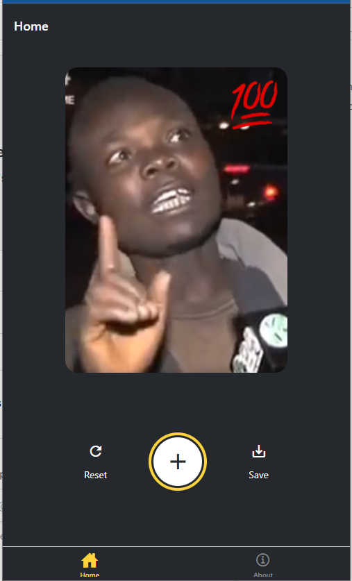

# Welcome to the Sticker Smash demo app 👋

This is a demo app for the Sticker Smash project. It is a simple app that allows you to take a picture and add stickers to it. It is built with React Native and Expo as part of their [Tutorial walkthrough](https://docs.expo.dev/tutorial/introduction/)  on how to get started with the updates to the Expo ecosystem.

## Learnings

- The new navigation system with expo-router
- implementing gestures with react-native-gesture-handler
- taking a screenshot and saving it to the device with react-native-view-shot and expo-media-library
  - expo-media-library has a permissions hook that makes it easy to ask for permissions.

This is an [Expo](https://expo.dev) project created with [`create-expo-app`](https://www.npmjs.com/package/create-expo-app).

## Get started

1. Install dependencies

   ```bash
   yarn install
   ```

2. Start the app

   ```bash
    yarn start
   ```

   ## Screenshots

   